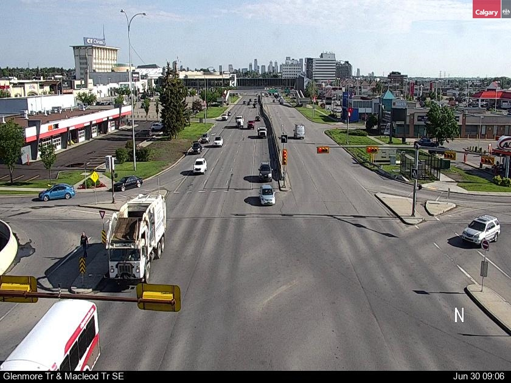
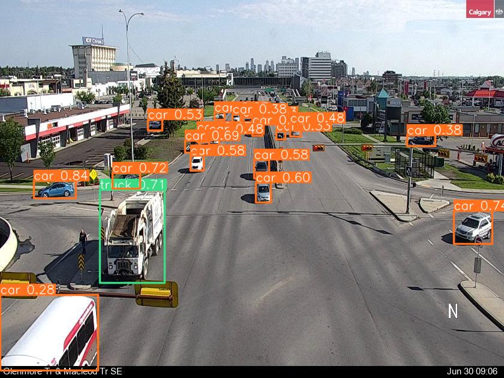
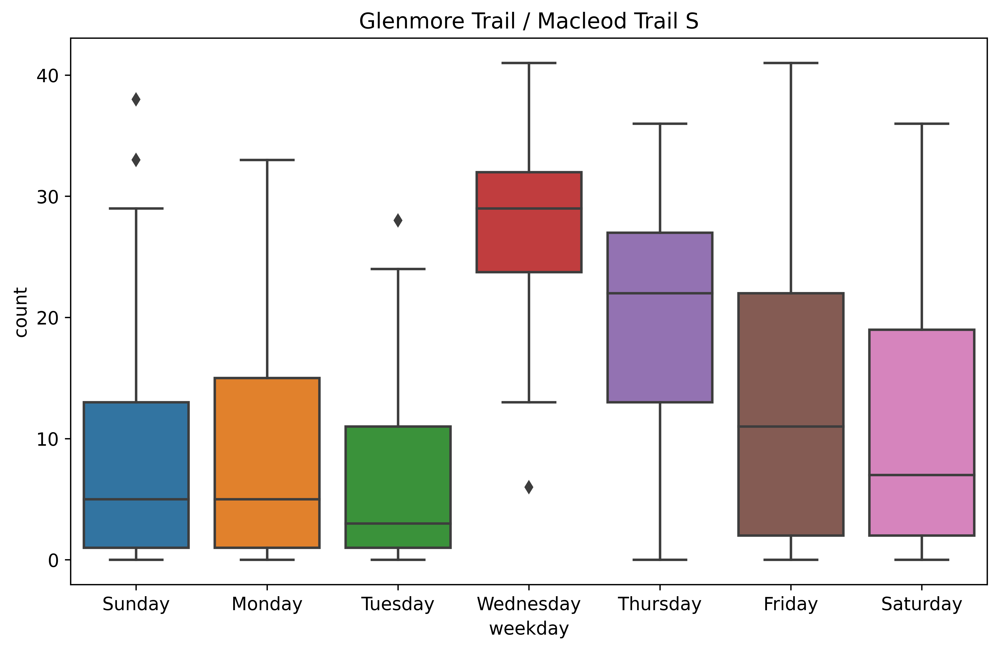

# yyc-traffic-cam

We can view City's up-to-minute traffic camera images on major routes and intersections with the links published at [Open Data portal](https://data.calgary.ca/Transportation-Transit/Traffic-Cameras/k7p9-kppz).

## Camera Image

Here's an example of Macleod Trail at Glenmore Trail.

## Object Detection

With a little help from YOLOv5, we can find all the vehicles from the image.

## Statistics

When we set up a cron job to fetch images from that camera location periodically over a certain time,
we can better understand the traffic patterns.

