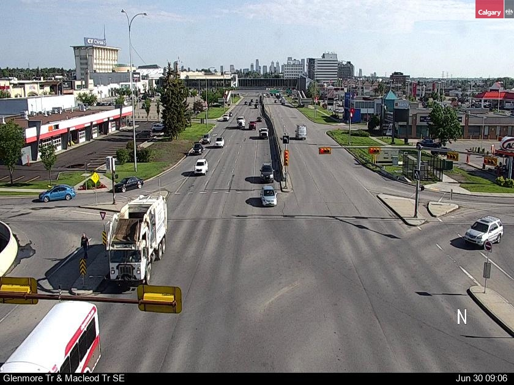
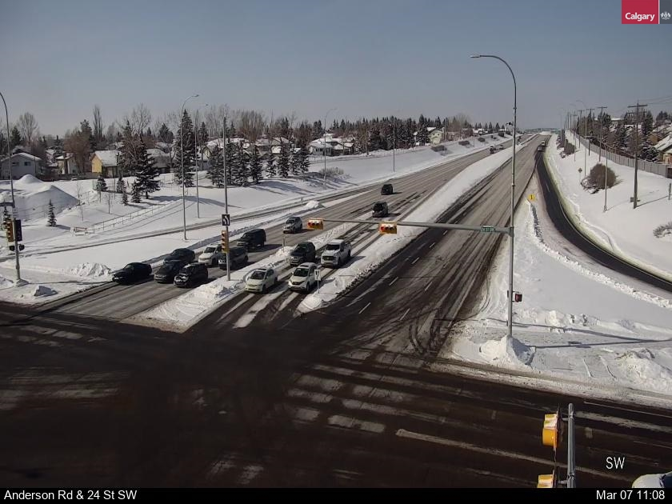
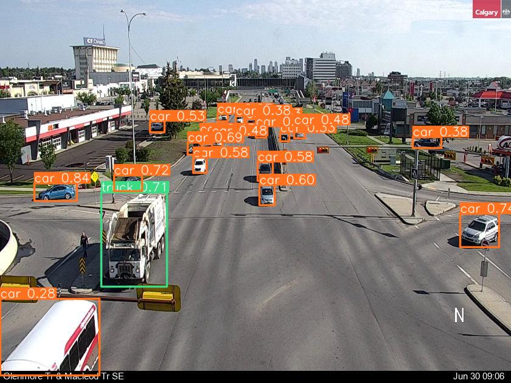
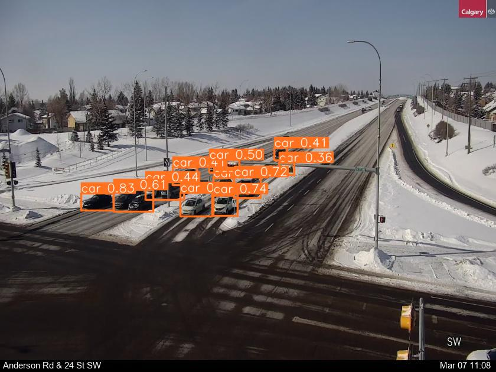
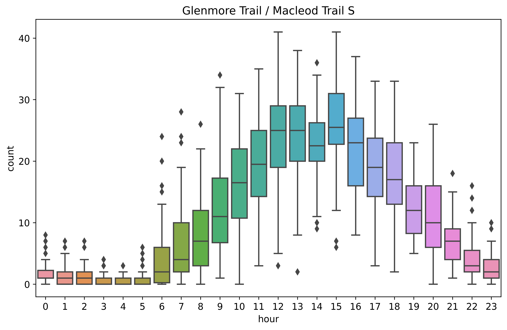
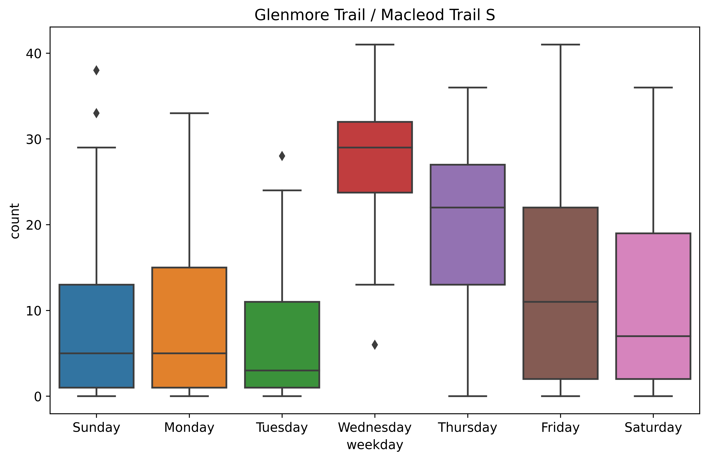
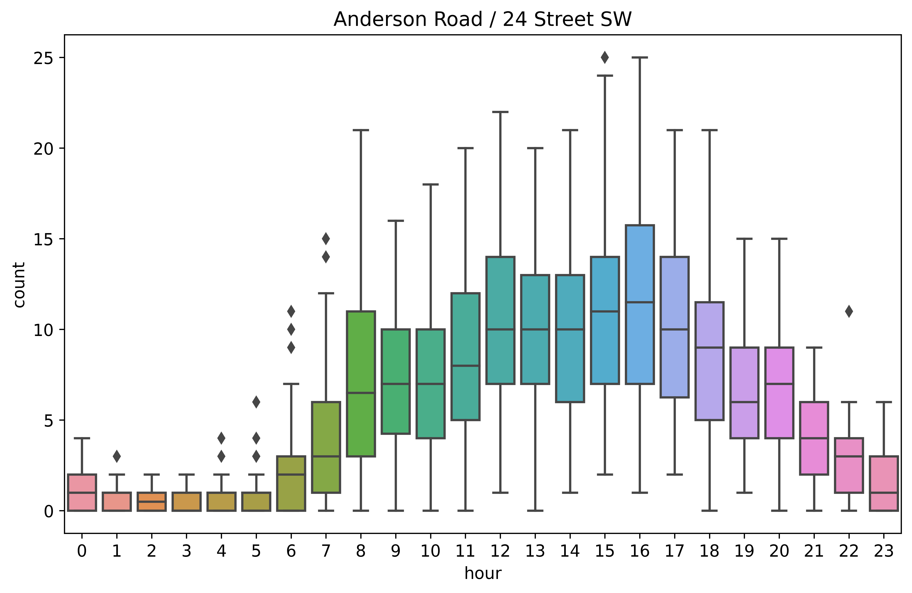
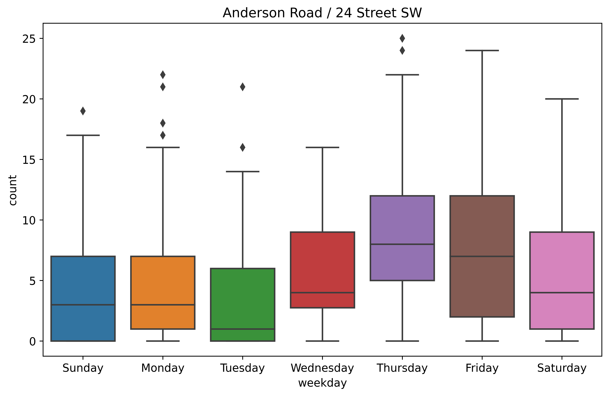

# yyc-traffic-cam

We can view City's up-to-minute traffic camera images on major routes and intersections with the links published at [Open Data portal](https://data.calgary.ca/Transportation-Transit/Traffic-Cameras/k7p9-kppz).

## Camera Images

Here are examples of

- Macleod Trail at Glenmore Trail [:material-camera-marker:](https://trafficcam.calgary.ca/loc0.jpg){target=\_blank}
- Anderson Road at 24 St SW [:material-camera-marker:](https://trafficcam.calgary.ca/loc104.jpg){target=\_blank}

<figure markdown>
{ width="48%", align="left" }
{ width="48%"}
</figure>

## Object Detection

With a little help from ~~YOLOv5~~ YOLOv8, we can find all the vehicles from the images.

<figure markdown>
{ width="48%", align="left" }
{ width="48%"}
</figure>

## Statistics

When we set up a cron job to fetch images from that camera location periodically over a certain time,
we can better understand the traffic patterns.

<figure markdown>
{ width="48%", align="left" }
{ width="48%"}
</figure>

<figure markdown>
{ width="48%", align="left" }
{ width="48%"}
</figure>
